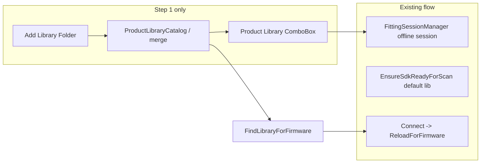

# External library folders (Connect Devices — Step 1)

## Current implementation (verified)

| Area | Location | Behavior |
|------|----------|----------|
| UI | [`ConnectDevicesView.xaml`](src/App/Views/ConnectDevicesView.xaml) | `ComboBox` → `AvailableLibraries` / `SelectedLibrary`, `DisplayMemberPath="FileName"` |
| Code-behind | [`ConnectDevicesView.xaml.cs`](src/App/Views/ConnectDevicesView.xaml.cs) | `INotifyPropertyChanged`; `InitializeSdkServicesAsync` calls `LibraryService.EnumerateLibraries()`, then `EnsureSdkReadyForScanAsync(SdkConfiguration.GetLibraryPath())` (default embedded `.library`, not the dropdown selection — intentional for scan stack) |
| Offline prep | Same + [`FittingSessionManager.CreateOfflineSessionAsync`](src/App/Services/FittingSessionManager.cs) | `SelectedLibrary` change → `LoadDefaultLibraryAsync(FullPath)` → offline session; `ParamFileService.FindParamForLibrary(libraryFileName)` only searches [`SdkConfiguration.GetProductsPath()`](src/Device/DeviceCommunication/SdkConfiguration.cs) |
| Firmware → library | [`LibraryService.FindLibraryForFirmware`](src/Device/DeviceCommunication/LibraryService.cs) + [`SdkManager.ReloadForFirmware`](src/Device/DeviceCommunication/SdkManager.cs) | Uses **`EnumerateLibraries()` only** (embedded today). **Must include external entries** after this feature or connect-time reload will ignore user-added libraries. |
| Model | [`LibraryInfo`](src/Device/DeviceCommunication/LibraryService.cs) (end of file) | `FileName` (stem), `FullPath`; `FileName` is used for firmware matching (`FindLibraryForFirmware`, mismatch check in `AttachDeviceAsync`) |

**Non-goals (unchanged):** SDK init for scan still uses default path from `GetLibraryPath()`; device scan/connect code paths stay separate; no copying files into `Assets/`.

### Additional code paths reviewed (March 2026)

- **`LibraryService.LoadLibraryByNameAsync`** ([`LibraryService.cs`](src/Device/DeviceCommunication/LibraryService.cs) ~140–144) resolves paths only via **`SdkConfiguration.GetLibraryPath(fileName)`** (embedded products). It is **not referenced elsewhere** in the repo today. External libraries must continue to load by **`FullPath`** (`LoadLibraryAsync` / `CreateOfflineSessionAsync`), as Step 1 already does. No change required unless a future caller uses `LoadLibraryByNameAsync` for an external-only product — then prefer full path or extend that helper.
- **Scan failure / troubleshooting copy** in [`ConnectDevicesView.xaml.cs`](src/App/Views/ConnectDevicesView.xaml.cs) (~628): user-visible text points only at `GetLibraryPath()` / embedded assets. **Update** this (and any similar strings) so troubleshooting mentions **external library folders** when the failure is not clearly “missing embedded file only.”
- **`HiProWiredDiscovery`** ([`HiProWiredDiscovery.cs`](src/Device/DeviceCommunication/HiProWiredDiscovery.cs) ~69–86): standalone `SdkManager.Initialize()` with default **`SdkConfiguration.GetLibraryPath()`** — diagnostic / alternate discovery path, **not** the Connect Step 1 catalog. **Out of scope** for folder-based product list; do not move catalog logic here.
- **`appsettings.json`**: only `Diagnostics` — **no** existing library-folder settings. **New** AppData JSON for external roots remains the right fit (consistent with audiogram persistence, not `appsettings`).
- **Target framework:** App project is **`net10.0-windows`** ([`Ul8ziz.FittingApp.App.csproj`](src/App/Ul8ziz.FittingApp.App.csproj)); Device is **`net10.0`**. Implementation and package/API choices should match **.NET 10** / current SDK, not older “.NET 8” wording from generic rules.

### Sound Designer SDK documentation (local review)

**Path reviewed:** `E:\Work\Fatting App\SoundDesignerSDK\documentation` (PDFs present: `sounddesigner_programmers_guide.pdf`, `sounddesigner_api_reference.pdf`, firmware bundle PDFs, mobile getting started — the latter are not required for desktop library loading).

| Document | Relevant section | Takeaway for this feature |
|----------|------------------|---------------------------|
| `sounddesigner_programmers_guide.pdf` | Ch. 6 *Working with Libraries*, **6.1 GETTING A LIBRARY** | Load via `LibraryProductManager::LoadLibraryFromFile(const char* path)` where **`path` is the path to the library file (with extension `.library`)**. |
| `sounddesigner_api_reference.pdf` | **2.1.3 LoadLibraryFromFile Method** (`ProductManager`) | Signature: `Library LoadLibraryFromFile(string path)`. **Parameter `path`:** *Path to the library file.* States that library files are produced with the **Sound Designer Software Library Manager** tool. |

**Conclusion:** The documented SDK surface is **file-path based** (`LoadLibraryFromFile`). There is **no documented API** to “open a folder” or enumerate product libraries; **folder selection + scanning for `*.library` in the app**, then passing each resolved path to `LoadLibraryFromFile`, matches the official contract and matches the plan’s “user-facing folder flow / internal file paths” approach.

**Implementation note:** Where code calls `LoadLibraryFromFile` for an externally discovered file, add a short comment citing **`sounddesigner_programmers_guide.pdf` (section 6.1)** and/or **`sounddesigner_api_reference.pdf` (section 2.1.3)** per workspace rules.

**Not in scope from these PDFs:** Recursive vs shallow folder scan — the API docs do not specify on-disk layout; keep recursive scan as an **app policy** (with doc comment: “not specified in SDK docs; app chooses `SearchOption.AllDirectories`”).

---

## Design decisions

1. **Structured `LibraryInfo` (extend, don’t replace)**  
   Add fields such as: stable `Id` (string), `SourceKind` (`Embedded` | `ExternalFolder`), optional `SourceRootFolder` (external root), `DisplayLabel` (for UI), and keep **`FileName` as the library stem** (no extension) so existing firmware matching and `LoadedLibraryName` / `StartsWith(match.FileName)` logic in [`FittingSessionManager`](src/App/Services/FittingSessionManager.cs) stays valid.

2. **Single merge point**  
   Implement merged enumeration inside [`LibraryService.EnumerateLibraries()`](src/Device/DeviceCommunication/LibraryService.cs) (or delegate to a small registry class in the same assembly) so **`FindLibraryForFirmware` automatically sees external libraries** without duplicating merge rules in `SdkManager` / `FittingSessionManager`.

3. **Ordering**  
   Define a **stable sort** for the merged list (e.g. embedded entries first, then external, both alphabetically by `DisplayLabel`; or one global sort by `DisplayLabel`) so the dropdown does not reshuffle unpredictably after refresh.

4. **Thread safety**  
   External roots and scanned entries may be updated on the **UI thread** while **`EnumerateLibraries()`** / **`FindLibraryForFirmware`** can run from **SDK gate / connection** contexts. Use an **immutable snapshot** or a **lock** around the merged list so reads are safe without races.

5. **Discovery**  
   User picks a **folder**; the app scans for `*.library` files (recommend **`SearchOption.AllDirectories`** with per-directory try/catch for permission errors). No user-facing single-file picker. Internally this is still paths to `.library` files passed to `LoadLibraryFromFile` — aligned with the SDK; the UX remains folder-based.

6. **Duplicates**  
   Build a unique `Id` per entry (e.g. `embedded:{stem}` vs `external:{fullPathToLibrary}`). **Display:** embedded entries keep a clean label (e.g. same as today); external entries use a subtle suffix such as `(External)`. If the same **stem** appears multiple times externally, disambiguate with a short parent folder or path fragment (e.g. `E7111V2 (External, VendorPack)`).

7. **`.param` resolution**  
   Extend [`ParamFileService`](src/Device/DeviceCommunication/ParamFileService.cs) with an overload or helper that, given **`libraryFullPath`**, looks for a sibling `stem.param` next to the `.library` first, then falls back to the existing embedded products directory search. Update [`LoadDefaultLibraryAsync`](src/App/Views/ConnectDevicesView.xaml.cs) to use that for auto-apply.

8. **Persistence**  
   Follow the existing pattern (e.g. [`AudiogramViewModel` app-data path](src/App/ViewModels/AudiogramViewModel.cs)): JSON under `%AppData%\Ul8ziz\FittingApp\` listing **external root folder paths** only (no copying of library files). On startup: drop missing/inaccessible folders quietly; optionally surface a single non-blocking status message if desired.

9. **Folder picker**  
   The App project currently has **WPF only** ([`Ul8ziz.FittingApp.App.csproj`](src/App/Ul8ziz.FittingApp.App.csproj)). Add **`UseWindowsForms`** and use `FolderBrowserDialog` (standard pattern), or an equivalent supported on `net10.0-windows` — keep the implementation minimal. **Alternative:** avoid WinForms by using the Windows folder picker COM API (`IFileOpenDialog` + `FOS_PICKFOLDERS`) via P/Invoke or a small helper — only if the team prefers zero WinForms reference.

10. **UI**  
    In the Setup card, keep the existing `ComboBox`; add a compact **“Add library folder”** (or wording consistent with nearby labels) **inside Step 1**, beside or directly under the combo (small `Button` + optional one-line helper text). Switch binding from `DisplayMemberPath="FileName"` to **`DisplayLabel`** (or a `TextBlock` in `ItemTemplate` if you need richer formatting). **Optional:** a lightweight **“Manage library folders…”** link opening a small dialog to remove persisted roots — only if it stays unobtrusive.

11. **Errors**  
    Cancelled picker → no-op. Empty/invalid folder → friendly `MessageBox` or a dedicated status property (match existing [`DiagnosticService`](src/App/Services/Diagnostics/) / message patterns). Malformed `.library` files: skip at discovery time if you cannot validate without loading; failed load on selection already goes through existing exception handling in `LoadDefaultLibraryAsync`.

12. **Vendor docs**  
    **Done (see table above):** `LoadLibraryFromFile` is file-path only; folder enumeration remains **app-side**. Recursive vs top-level scan is **not specified** in the reviewed PDFs — implement as app policy and state that in a brief code comment.

---

## Files to touch (expected)

| File | Change |
|------|--------|
| [`LibraryService.cs`](src/Device/DeviceCommunication/LibraryService.cs) | Extend `LibraryInfo`; implement merged `EnumerateLibraries()` + registry; keep `FindLibraryForFirmware` using merged list |
| New: e.g. `ProductLibraryRegistry.cs` (Device) | Thread-safe external roots + cached scanned `LibraryInfo` list; set from App |
| [`ParamFileService.cs`](src/Device/DeviceCommunication/ParamFileService.cs) | Resolve `.param` next to library file + existing fallback |
| [`ConnectDevicesView.xaml`](src/App/Views/ConnectDevicesView.xaml) | Step 1: button + helper text; combo `DisplayMemberPath` / template |
| [`ConnectDevicesView.xaml.cs`](src/App/Views/ConnectDevicesView.xaml.cs) | Folder command, refresh merged list, restore selection by `Id`, wire registry before `EnumerateLibraries`; **update scan/SDK failure user strings (~628)** so they are not misleading when libraries live only under external folders |
| New: `ExternalLibraryFoldersSettings.cs` (App) | Load/save JSON list of folder paths |
| [`Ul8ziz.FittingApp.App.csproj`](src/App/Ul8ziz.FittingApp.App.csproj) | `UseWindowsForms` if using WinForms folder dialog |
| [`docs/connect-devices-screen.md`](docs/connect-devices-screen.md) | Optional short update (only if you want docs in sync) |

Connect-time error copy in [`ConnectDevicesView.xaml.cs`](src/App/Views/ConnectDevicesView.xaml.cs) that mentions only `Assets\SoundDesigner\products\` should be adjusted to mention external folders when relevant.

---

## Verification checklist

- Embedded libraries still appear and behave as before.
- Add folder → libraries appear in dropdown with external labeling; empty folder → clear message; no crash.
- Select external library → offline session and param sibling resolution work.
- Connect → `ReloadForFirmware` finds library for firmware when it exists only under an external folder.
- Persisted folder removed on disk → next launch does not crash; list still valid.
- Duplicate names → distinct labels and stable `FullPath` for SDK.

---

## Developer summary (for your deliverable #4)

After implementation, the summary should cover: **files changed**, **models/services** (`LibraryInfo` extension, registry + settings, `ParamFileService` overload), **discovery** (recursive `*.library` under chosen root), **merging** (single `EnumerateLibraries` / `FindLibraryForFirmware` path), **persistence** (AppData JSON of folder paths), **SDK doc citations** (`sounddesigner_programmers_guide.pdf` §6.1 / `sounddesigner_api_reference.pdf` §2.1.3 for `LoadLibraryFromFile`), and **assumptions** (recursive scan is app policy; SDK contract is file path to `.library`).
